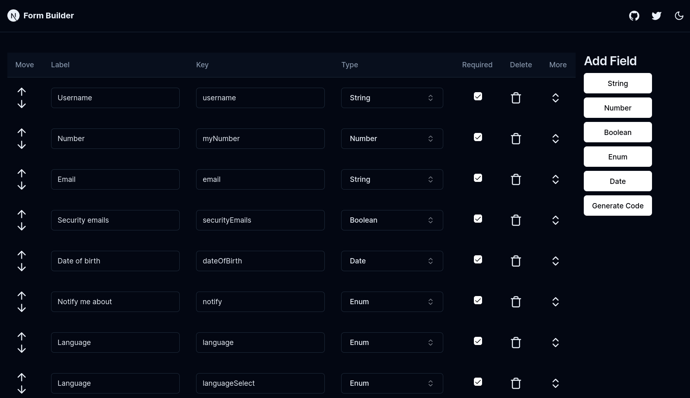

# Form Builder for @shadcn/ui

UI based codegen tool to easily create @shadcn/ui forms.

Try it out <https://formbuilder.kurdmake.com>.

## Field types

Currently, these field types are implemented:

- string (input)
- number (input)
- boolean (switch)
- enum (select, radio, combobox)
- date (date picker)

## Contributing

Contributions are welcome! Please open an issue or submit a pull request.

## License

MIT
